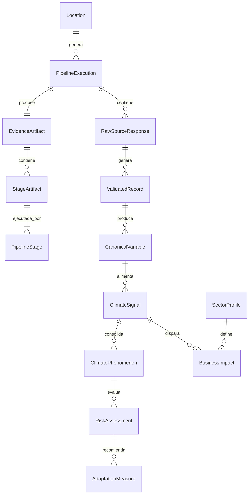

# Data Model — Climate Risk Pipeline

**Date**: 2026-06-22 | **Spec**: [spec.md](spec.md)

## Entity Relationships

## Core Entities

### Location
- `lat`: number (-90, 90)
- `lon`: number (-180, 180)
- `elevation`: number (m) — opcional, de fuente autoritativa
- `location_name`: string — resuelto desde WeatherAPI
- `country`, `region`: string — contexto geopolítico

### PipelineExecution
- `execution_id`: UUID
- `location`: Location
- `sector`: string — sector económico
- `timestamp`: datetime
- `status`: enum(pending, running, completed, partial, failed)
- `source_count_total`: int
- `source_count_success`: int
- `source_count_failed`: int
- `source_count_out_of_coverage`: int
- `duration_ms`: int

### RawSourceResponse
- `source_name`: string — identificador único (e.g., "nasa_power")
- `source_domain`: string — dominio de información
- `authority_level`: enum(primary, complementary)
- `request`: object — endpoint, params, timestamp
- `response`: object — body crudo completo
- `status_code`: int
- `duration_ms`: int
- `error`: string? — si falló
- `coverage_status`: enum(available, out_of_coverage, failed)
- `spatial_distance_km`: number? — distancia al punto más cercano con datos
- `resolution_native`: string? — resolución nativa de la fuente

### ValidatedRecord
- `source`: string — referencia a RawSourceResponse
- `validation_results`: object[] — regla aplicada, resultado, detalle
- `fill_values_detected`: string[]
- `null_fields_detected`: string[]
- `is_valid`: boolean
- `warnings`: string[]

### CanonicalVariable
- `name`: string — nombre normalizado (e.g., "air_temperature_current")
- `unit`: string — unidad estándar
- `value`: any — valor normalizado
- `source`: string — referencia a RawSourceResponse
- `source_authority`: enum(primary, complementary)
- `timestamp`: datetime
- `spatial_info`: object — lat/lon real usado, distancia, resolución
- `coverage_action`: enum(direct, nearest_neighbor, interpolated, out_of_coverage)

### ClimateSignal
- `signal_id`: UUID
- `name`: string — nombre semántico (e.g., "enso_transition")
- `type`: enum(anomaly, trend, categorical, projected)
- `value`: any — valor de la señal
- `source_variables`: string[] — referencias a CanonicalVariable
- `source_quality`: number (0-1)
  - `components`: { coverage_spatial, coverage_temporal, completeness, resolution, proximity }
  - `weights_applied`: object — pesos usados
- `signal_strength`: number (0-1)
  - `components`: { anomaly_magnitude, temporal_persistence, cross_period_consistency, projected_change }
- `anomaly_value`: number?
- `anomaly_unit`: string?
- `rules_applied`: string[] — umbrales y reglas usadas

### ClimatePhenomenon
- `phenomenon_id`: UUID
- `name`: string — nombre canónico (e.g., "el_nino", "sequia", "inundacion")
- `status`: enum(active, projected, historical, not_detected)
- `confidence`: { source_quality, signal_strength, combined }
- `contributing_signals`: UUID[] — referencias a ClimateSignal
- `scenario`: string? — SSP escenario si es proyectado
- `horizon`: enum(corto_plazo, mediano_plazo, largo_plazo)

### Exposure
- `phenomenon_id`: UUID
- `level`: enum(baja, media, alta, sin_datos)
- `factors`: string[] — factores contextuales que contribuyen
- `context_variables_used`: string[] — variables de Location usadas

### RiskAssessment
- `risk_id`: UUID
- `phenomenon_id`: UUID
- `scenario`: string — escenario climático
- `horizon`: enum(corto, mediano, largo)
- `probability`: int (1-5)
  - `source`: enum(external, calculated) — de dónde vino
  - `external_source`: string? — si vino de fuente
  - `justification`: string
- `impact`: int (1-5)
  - `components`: { exposure, sensitivity, adaptive_capacity }
  - `justification`: string
- `adaptive_capacity`: int (1-5)
  - `indicators_used`: string[]
  - `justification`: string
- `risk_score_raw`: number — (P × I) / CA
- `risk_level`: enum(bajo, medio, alto, catastrófico)
- `risk_classification`: enum(operativo, estrategico)

### AdaptationMeasure
- `measure_id`: UUID
- `risk_id`: UUID
- `description`: string
- `type`: enum(estructural, naturaleza, gestion, financiera)
- `priority`: enum(baja, media, alta)
- `urgency`: string
- `feasibility`: string
- `co_benefits`: string[]
- `impact_reduction`: string

### EvidenceArtifact
- `artifact_id`: UUID
- `execution_id`: UUID
- `version`: string — "2.0"
- `created_at`: datetime
- `pipeline_summary`: object — conteo de etapas, estado global
- `stages`: StageArtifact[]
- `final_result`: RiskAssessment[]
- `narratives`: { executive: string, analyst?: string }
- `rules_applied`: string[] — todas las reglas del pipeline

### StageArtifact
- `stage_id`: int
- `stage_name`: string
- `input`: object — resumen de entrada
- `output`: object — resumen de salida
- `rules_applied`: string[]
- `duration_ms`: int
- `status`: enum(success, partial, failed)
- `error`: object? — si falló

### SectorProfile
- `sector_id`: string (e.g., "retail", "finance", "agriculture")
- `signal_to_impact_mapping`: object[] — qué señales generan qué impactos
- `default_adaptive_capacity`: int (1-5)
- `sensitivity_factors`: string[]

### BusinessImpact
- `sector`: string
- `signal`: string — referencia a ClimateSignal
- `description`: string — "Interrupción de cadena logística por lluvias intensas"
- `financial_impact_estimate`: string — rango orientativo
